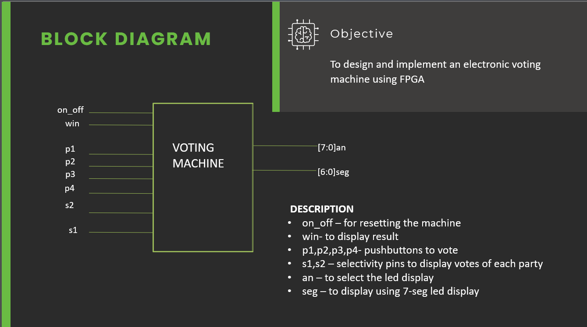
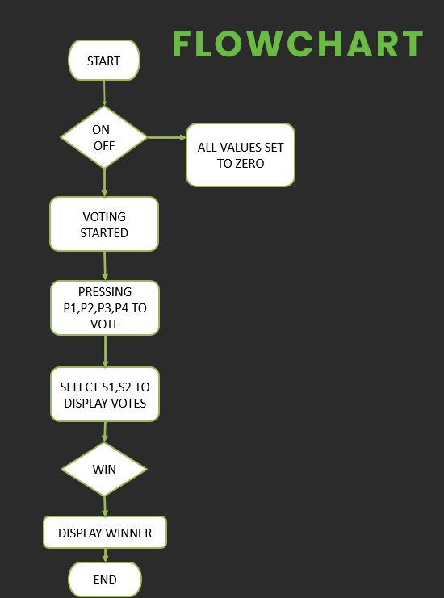
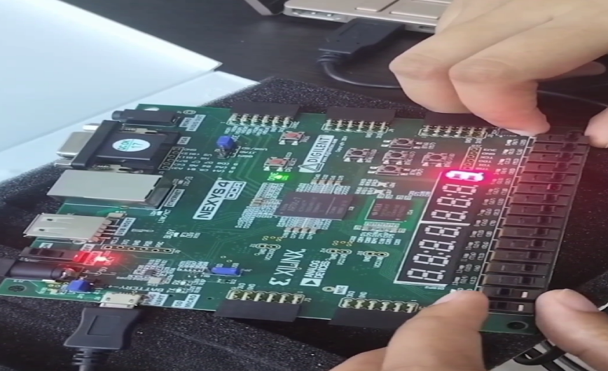

# FPGA-Based Electronic Voting Machine

This project implements an electronic voting machine (EVM) using FPGA technology. The EVM is designed to cast, count, and display votes securely and efficiently using hardware features like pushbuttons, switches, and a 7-segment LED display.

---

## Table of Contents
1. [Introduction](#introduction)
2. [Features](#features)
3. [System Description](#system-description)
4. [Block Diagram](#block-diagram)
5. [Flowchart](#flowchart)
6. [Improvements](#improvements)
7. [Getting Started](#getting-started)
8. [Contributors](#contributors)

---

## Introduction

The primary goal of this project is to design and implement a functional electronic voting machine that can:
- Cast votes for multiple parties.
- Display the vote count for each party.
- Declare the winning party based on the highest votes.

---

## Features

- **Reset Functionality:** The system can be reset to prepare for a new voting session.
- **Vote Casting:** Four pushbuttons are used to cast votes for four different parties.
- **Vote Count Display:** Votes can be displayed for individual parties using selectivity switches.
- **Winner Declaration:** A dedicated switch displays the winning party number.
- **FPGA Implementation:** The system leverages the speed and reliability of FPGA hardware.

---

## System Description

### Components
- **Pushbuttons (P1, P2, P3, P4):** For voting for parties 1, 2, 3, and 4.
- **Selectivity Pins (S1, S2):** To display vote counts for specific parties:
  - S1=0, S2=0 → Party 1
  - S1=0, S2=1 → Party 2
  - S1=1, S2=0 → Party 3
  - S1=1, S2=1 → Party 4
- **7-Segment LED Display:** Shows votes and the winning party.
- **ON/OFF Switch:** Resets the system.
- **WIN Switch:** Displays the winning party.

---

## Block Diagram

## Flowchart

## Implementation

## Improvements

Potential future enhancements:
1. Add additional LED segments to display multi-digit votes (e.g., tens and units place).
2. Display all party votes simultaneously by removing selectivity switches.
3. Optimize the code to use a single display function for better efficiency.

---

## Getting Started

### Prerequisites
- **Hardware:** FPGA development board.(xc7a100tcsg324-1)
- **Software:** Tools for coding and uploading Verilog to the FPGA (e.g., Xilinx Vivado).

